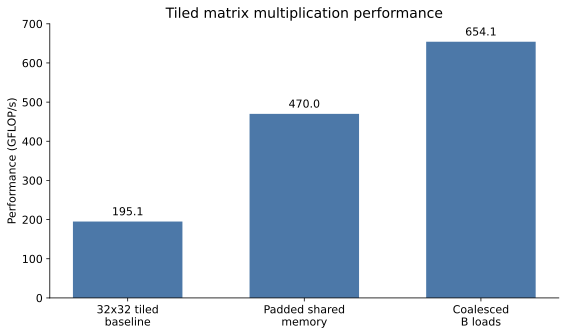
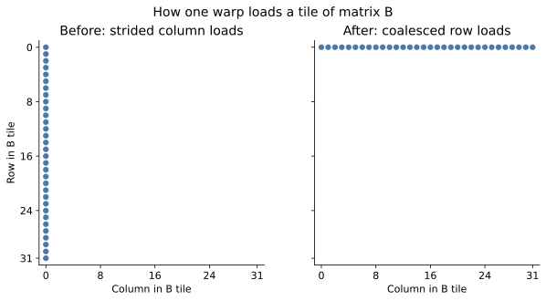

# CUDA kernels journey

This README documents my path from my first vector addition to a handwritten 2D  **2774.8 GFLOP/s** (peak) block-tiled matrix multiplication kernel on an NVIDIA T4 (with a 2381.6 GFLOP/s 20 launch average).

My code is not perfect, and I am deliberately keeping my mistakes and intermediate kernels because I want to show all my wrong assumptions, indexing problems, and the small hardware aware changes that I made behind every speedup.

My first big example was my 1D tiled matmul (which since I had not learned to use 2D shared memory arrays yet, I had to flatten every tile manually).

Its first working version reached 195.1 GFLOP/s, below my naïve matmul's 355.9 GFLOP/s, but then removing bank conflicts raised it to 470 GFLOP/s, and coalescing B loads pushed it to 654.1 GFLOP/s.

But I did not stop there, after learning 2D indexing, writing a 16x16 tiled kernel, and making a first blocktiling version which was actually slower, my current 2D blocktiling kernel makes every thread calculate a 4x4 section of C and reached a best launch of 2774.8 GFLOP/s. Going from around 600 to around 2700 is by far my biggest jump in this repository right now.

## Complete performance journey so far

| Kernel iteration | What I was learning/changing | Recorded GFLOP/s |
|---|---|---:|
| Naïve matmul | One thread calculates one result | 355.9 |
| 1D 32x32 tiled baseline | My first correct shared-memory tiles | 195.1 |
| Padded 1D tiles | Removed shared-memory bank conflicts | 470.0 |
| Coalesced B loads | Fixed how B arrived from global memory | 654.1 |
| 2D 16x16 tiled | Real 2D blocks and 2D shared memory | 639.9 |
| 1D blocktiling | Four results per thread, after fixing the indexing | around 400 |
| 2D blocktiling | 4x4 results per thread, 20-launch average | 2381.6 |
| 2D blocktiling | Best one of 50 individual launches | **2774.8** |


The last bar is deliberately the best individual launch because it makes the size of my current jump very easy to see, but my repeatable number from the same run is closer to 2380 GFLOP/s, I explain both numbers and the benchmark later instead of hiding the slower one.

## Performance journey on my 1D 32x32 Tiled Matmul

| Tiled matmul iteration | What changed | GFLOP/s | Improvement |
|---|---|---:|---:|
| Correct 32×32 tiles | First validated baseline | 195.1 | x1.00 |
| Padded shared memory | Removed bank conflicts with a 32×33 layout | 470.0 | x2.41 |
| Coalesced B loads | Each warp loads consecutive values from one row | 654.1 | x3.35 |



The latest change added **184.1 GFLOP/s** over the padded version, which would be about **39%**, or **1.39×**. Calling it “around 200 GFLOP/s” is a fair rough description, but 184.1 GFLOP/s is the difference between the two recorded results.

## How I got here

### 1. Starting with vector addition

My first kernel was [`vector-add/vector_add.cu`](vector-add/vector_add.cu). 
It basically taught me me the basic CUDA loop, allocate host and device memory, copy the inputs, map one thread to one output, launch the kernel, and copy the result back.

```cpp
int i = blockIdx.x * blockDim.x + threadIdx.x;
if (i < N) C[i] = A[i] + B[i];
```

The operation is very simple, but it helped me land the correct mental model I needed before moving to a kernel where indexing and memory access were more difficult.

This was not even a serious benchmark yet, the program prints all one million results, I had no CUDA events and I was still measuring the whole experience more than the kernel. So I do not invent a GFLOP/s number for it in the graph, it is just where the journey started.

### 2. Writing a naïve matmul, and discovering that my first bug was outside the kernel

In [`matmul/naive-matmul.cu`](matmul/naive-matmul.cu), each thread computes one output value, and basically my first ever attempt produced invalid results, including inf, and looking back through my commits, my matrix setup had three main separate problems:

```cpp
size_t bytes_m2 = M_fil_1 * K_col_2 * sizeof(float); //  I had the wrong number of rows

for (int i = 0; i < M_fil_2 * K_col_2; i++)
    h_mat1[i] = 3.0f;                                // here wrote wrongly into A again

cudaMemcpy(d_mat2, h_mat1, bytes_m2,
           cudaMemcpyHostToDevice);                 //  here I copied A instead of B, (rookie mistake)
```

I had under-allocated B, initialized the wrong host pointer, and then copied the wrong matrix to the device, very bad stuff.

I fixed all three together:

```cpp
size_t bytes_m2 = M_fil_2 * K_col_2 * sizeof(float);

for (int i = 0; i < M_fil_2 * K_col_2; i++)
    h_mat2[i] = dist(gen);

cudaMemcpy(d_mat2, h_mat2, bytes_m2,
           cudaMemcpyHostToDevice);
```

I also switched to random floats in the range `[-2, 2]`, to not get giant numbers. 

### 3. Building a benchmark instead of trusting one launch

Once the naïve version was working, I added a single-threaded CPU implementation as a reference, to measure the Speedup compared to a CPU, and also to check if my kernel worked correctly (this will come very handy in the tiled matmul later).

I then changed the GPU measurement from one launch to three warm-up launches followed by 20 timed iterations using CUDA events (I was helped by claude Opus 5 in medium setting to build this benchmark step, since at this point I was very early at learning CUDA, and needed this right away):

```cpp
for (int i = 0; i < 3; i++)
    matmul<<<blocks, threads>>>(...);
cudaDeviceSynchronize();

cudaEventRecord(start);
for (int i = 0; i < 20; i++)
    matmul<<<blocks, threads>>>(...);
cudaEventRecord(stop);
cudaEventSynchronize(stop);
```

This benchmark basically gave me a repeatable kernel time, a CPU comparison, and a way to calculate throughput rather than relying only on milliseconds.

### 4. My first shared-memory design did not work

In my first shared-memory attempt (which is preserved in the git history before the current tiled file), I tried to cache the complete data needed by each output in two block-wide shared arrays:

```cpp
shared_memory_2[threadIdx.x] =
    mat2[col_num_1 + threadIdx.x * K_col_2];

sum += shared_memory_1[j] * shared_memory_2[j];
```

The problem I had just unknowingly created was a design problem, not just a typo. 
Every thread was computing a different output column, but all 1024 threads were writing their values into the same shared array as if it were private to each thread. 
After synchronization, that array was a mess, intended for different outputs, and of course this did not work at all.

I temporarily removed the second shared array and went back to reading B from global memory, which wasn't the optimization I wanted, but it gave me a correct stepping stone and helped me understand that shared memory has to represent data a whole block can genuinely reuse.

### 5. Moving to real 32×32 tiles in 1D

My next attempt, now [`tiled-matmul/tiled_matmul_1d.cu`](tiled-matmul/tiled_matmul_1d.cu), made each 1024-thread block responsible for a 32×32 output tile.

Keeping the tiles in 1D meant that I had to map every row and column by hand instead of using cleaner 2D indexing.

My first indexing still treated the flattened global thread ID as if it directly described the tile:

```cpp
// Before
int block_row = i / (K_col_1 * 32);
int block_col = i / (M_filas_2 * 32);

shared_memory_1[threadIdx.x] = mat1[... + threadIdx.x];
result[i] = sum;
```

This did not correctly separate the block position from the thread position, so I refactored the mapping around `blockIdx.x`, used `% 32` for a thread's column inside the tile, and explicitly mapped the result back into the output matrix:

```cpp
int block_row = blockIdx.x / 32;
int block_col = blockIdx.x % 32;

int tile_row = threadIdx.x / 32;
int tile_col = threadIdx.x % 32;
```

I then added a complete CPU/GPU comparison instead of checking only the first few values (because I had an error that could not be detected by comparing the first values from both the CPU and GPU alone) (again, for benchmarks like this one, I asked for it to Claude Opus 5 in the medium effort setting):

```cpp
float max_error = 0.0f;
for (int i = 0; i < N; i++)
    max_error = fmaxf(max_error, fabsf(h_result[i] - h_C_cpu[i]));
```

After having refactored my mapping, my kernel's first version measured 197.1 GFLOP/s, which is worse than my naïve matmul (my naÏve matmul implementation benefits a lot from cache). 

The later validated run was 195.1 GFLOP/s, which is why that is the baseline I use in the table and graph, they are basically the same very disappointing performance but I wanted to keep the recorded values clear.

At this point I was surprised, because I was expecting tiled matmul to do much better than my naïve matmul, but even tho my tiled matmul was producing the correct output, my kernel was slow, despite adding shared memory, it had not automatically made the kernel faster.

### 6. Removing shared-memory bank conflicts: 195.1 → 470 GFLOP/s

Finding this speedup opportunity took me 5 hours of sitting around and looking at my poorly written code, which I had overcomplicated, because I had written it to work with a 1D memory, since I hadn't learned to use 2D memories at this point, and I overcomplicated debugging also by not commenting at all my code.

To understand what was going wrong, in the inner product, each warp read B from shared memory with a stride of 32:

```cpp
// 32×32 
__shared__ float shared_memory_2[32 * 32];
value = shared_memory_2[column * 32 + k];
```

And because the T4 has 32 shared-memory banks, a stride of 32 mapped those per-thread addresses back onto the same bank, which basically means my accesses were seralizing instead of happening in parallel, and that's something we don't want to happen if we want to go fast.

So I added a one padding element per row and changed the stride to 33:

```cpp
// 32×33 padded layout
__shared__ float shared_memory_2[32 * 33];
value = shared_memory_2[column * 33 + k];
```

That extra column is only 32 additional floats, but it shifts each row onto a different bank. 
This change alone made my throughput jump from 195.1 to 470 GFLOP/s, a x2.41 improvement.

This was the first time where I could connect a very small code change to a specific piece of my T4 GPU hardware and then see the effect clearly in the benchmark.

### 7. Coalescing the global loads for B:   470 → 654.1 GFLOP/s

When I fixed the padding, it fixed how B was *read from my shared memory*, but there was another problem, which took me even more time to find than the 5h I had to spend reading the code for the first. 

Basically now I was reading from shared memory correctly, but my data still had to get there from global memory, and the problem was HOW it was arriving from global memory. 

Before my latest change, the lanes in a warp loaded values from the same column across different rows:

```cpp
// simplification extracted from my code, renamed variables to make it more understandable for everyone
int column = threadIdx.x / 32; 
int row    = threadIdx.x % 32; 

shared_memory_2[column * 33 + row] =
    mat2[tile_base + row * K_col_2 + column];
```

This meant that lanes were separated by `K_col_2` elements in global memory, which was a distance of 1024 floats. Which means that I wasn't doing coalescing correly, what I had were heavily strided loads.

I thought of remapping each warp so its lanes load consecutive columns from one row (addapting to row-mayor format):

```cpp
// After: the lanes in a warp move across one row of B
int row    = threadIdx.x / 32; // constant within a warp
int column = threadIdx.x % 32; // changes across the warp

shared_memory_2[column * 33 + row] =
    mat2[tile_base + row * K_col_2 + column];
```

This meant my global reads were now coalesced, while the transposed write into `shared_memory_2[column * 33 + row]` preserves the padded layout used by the computation.



This raised my result from 470 to 654.1 GFLOP/s: +184.1 GFLOP/s, about 39% faster than the previous version and x3.35 faster than the first validated tiled kernel.

### 8. Learning 2D indexing before trying to tile with it

Until this point I had been flattening everything into one dimension, it worked but it also made the code much harder to reason about than it needed to be. 
So before jumping directly into another matmul, I made [`2d-transposed/2d-transposed.cu`](2d-transposed/2d-transposed.cu), a much smaller matrix transpose/addition exercise where I could learn `dim3`, `.x`, `.y`, and this mapping without having a whole multiplication around it (that transposed code is not rigorous at all tho):

```cpp
int row_pos = blockIdx.y * blockDim.y + threadIdx.y;
int col_pos = blockIdx.x * blockDim.x + threadIdx.x;
```

Then I used the same mapping in [`matmul/2d-naive-matmul.cu`](matmul/2d-naive-matmul.cu). 
Which produced roughly the performance I expected from my first naïve matmul, although the benchmark oscillated from around 420 to 285 to 315 GFLOP/s, and at this point I did not understand why yet.

This step was not a speedup, but it made the next kernels much easier to write

### 9. A real 2D 16x16 tiled matmul, and another synchronization mistake

My first version of [`tiled-matmul/tiled_matmul_2d.cu`](tiled-matmul/tiled_matmul_2d.cu) was much easier to write than the flattened 1D version, mostly because a thread's `(x, y)` coordinates matched the column and row in my 2D shared-memory tiles.

```cpp
__shared__ float shared_memory_1[16][16];
__shared__ float shared_memory_2[16][16];

sum += shared_memory_1[threadIdx.y][j]
     * shared_memory_2[j][threadIdx.x];
```

The first benchmark reached 639.9 GFLOP/s, basically next to the 641.6/654.1 area of my better 1D tiled code but with indexing that I could understand much more easily.

But it had a hidden bug. I had put `__syncthreads()` inside a bounds check, which means that on an edge block, some threads would arrive at the barrier and the out of range threads would not. The block would then sit there waiting forever. 
My current dimensions were multiples of the tile size so it managed to stay hidden, basically a ticking time bomb waiting for me to change the dimensions.

I moved the bounds checks to the loads instead, filling invalid cells with zero, and kept the barriers where every thread in the block reaches them:

```cpp
shared_memory_1[threadIdx.y][threadIdx.x] = in_bounds_A
    ? A[global_A_address] : 0.0f;
shared_memory_2[threadIdx.y][threadIdx.x] = in_bounds_B
    ? B[global_B_address] : 0.0f;

__syncthreads();
```

The zero leaves the dot product unchanged and also fixed the unchecked final K tile. 
I knew my older 1D tiled version had similar dimension assumptions, but I decided to leave that historical version alone and move forward, I guess I'm just trying to learn here.

### 10. My first blocktiling attempt calculated four outputs per thread, and got slower

The next idea to learn was to stop making one thread calculate only one number. 

In [`blocktiling/blocktiling1d.cu`](blocktiling/blocktiling1d.cu), an 8x8 thread block covers a 16x16 output tile, and each thread keeps four sums and produces four output rows:

```cpp
float sum1 = 0.0f;
float sum2 = 0.0f;
float sum3 = 0.0f;
float sum4 = 0.0f;
```

This sounds simple when I write it now, but my first indexing was absolutely not simple, and I overcomplicated it a lot, to the point where debugging was genuinely very hard. 

I made variables like `threadIdx_r4_1` and `threadIdxy4_1` to stretch the 8x8 threads over the 16x16 loads, and I had many out of index errors, wrong dimension multipliers and then after a couple of hours debugging I still thought the error was in my sum loop.

There were far more bugs than I first thought. 
The block origin was using `blockDim` when it had to use the output tile size, several B loads overwrote the same shared memory position, and the four results were not mapped back to consecutive output rows correctly.

After refactoring those positions around `BM`, `BN`, and `BK`, the GPU finally matched the CPU, but performance averaged only around **400 GFLOP/s**, which was very underwhelming next to the **641.6 GFLOP/s** 2D tiled kernel that I was building on top of. More work per thread was an idea, not an automatic optimization, since I still had things to learn about CUDA and given my overcomplicated kernel, finding the Speedups was hard and time consuming for me.

I then renamed it 1D blocktiling because the thread owns four values in only one direction, removed some dead code and started trying to follow a naming convention because I had learned with my 1D blocktiling and my 1D 32x32 from a week before that if I didn't use a clear name convention and comments I was going to have a very hard time debugging my code. 

This file still looks strange, but it is the step before the 4x4 register tile I use now.

### 11. Moving to 2D blocktiling: 654.1 -> 2774.8 GFLOP/s (My biggest jump)

My current kernel, [`blocktiling/blocktiling2d.cu`](blocktiling/blocktiling2d.cu), uses a **64x64** block tile, moves through K in chunks of **32**, and gives every thread a **4x4** part of C:

```cpp
constexpr int BM = 64;
constexpr int BN = 64;
constexpr int BK = 32;
constexpr int TM = 4;
constexpr int TN = 4;

float sum[TM][TN] = {0.0f};
float regA[TM];
float regB[TN];
```

There are 16x16 = 256 threads, but every thread now accumulates 16 outputs, so together the block calculates all 4096 values in its 64x64 C tile. 
And for each position in K, I load four A values and four B values into registers and reuse them as a small outer product:

```cpp
for (int j = 0; j < TM; j++)
    regA[j] = shared_memory_1[threadIdx.y * TM + j][k];

for (int j = 0; j < TN; j++)
    regB[j] = shared_memory_2[k][threadIdx.x * TN + j];

for (int j = 0; j < TM; j++)
    for (int t = 0; t < TN; t++)
        sum[j][t] += regA[j] * regB[t];
```

This is much more multiply adds for the values I bring from shared memory, and it is the first time in this repository where I am using register tiling in both output dimensions.

The first file was only a sketch tho, and it was much more broken than I realized when committing it, half of my index variables did not even have a type, I wrote `dim3 threads[16][16]` which declares an array instead of a 16x16 block (rookie mistake), and I manually looped over every output tile inside every CUDA block. 
That last mistake would make each block try to repeat the grid's job, basically around x256 work without producing x256 useful results.

The grid already tells each block which tile it owns, so I removed that outer loop and derived the origin directly from `blockIdx`:

```cpp
int col_ini_bloque = blockIdx.x * BN;
int row_ini_bloque = blockIdx.y * BM;
```

Then I fixed the A and B global addresses to use their real row strides, filled in both K offsets, added the missing barriers after loading and after computing each K tile, wrote the complete inner product and finally mapped the 4x4 accumulators back to C.

My result for `2048x1024 * 1024x2048` was:

```text
CPU:          31532.8 ms
GPU:              3.607 ms  (2381.6 GFLOP/s, 20-launch average)
min:              3.096 ms  (2774.8 GFLOP/s)
median:           3.612 ms  (2378.3 GFLOP/s)
max:              3.617 ms  (2375.0 GFLOP/s)
Max abs diff: 0.000106812 (at index 3831606)
```

Also the full output matches the CPU reference result.

Compared with the old 654.1 GFLOP/s result, the current average is x3.64 as fast and the best launch is x4.24 as fast, by far my biggest speedup, which compared with my first validated tiled kernel at 195.1 GFLOP/s, it is a x14.22 peak improvement, which is a fairly ridiculous difference for me to see after all the versions above.

I added the min/median/max timing block with help from a model because I wanted to understand the unpredictable GFLOP/s values and I did not know how to build that benchmark yet. 
The kernel and all the indexing/debugging described here are mine.

## How the benchmark works

I recorded the results that I'm presenting in **Google Colab on an NVIDIA T4**, and most of the earlier kernels use this fixed multiplication:

```text
A: 1024 × 2048
B: 2048 × 1024
C: 1024 × 1024
Work: 2 × M × N × K ≈ 4.295 billion floating point operations
```

The current 2D blocktiling benchmark changed the shape and doubled the work:

```text
A: 2048 × 1024
B: 1024 × 2048
C: 2048 × 2048
Work: 2 × M × N × K ≈ 8.590 billion floating point operations
```

I calculate throughput with:

```text
GFLOP/s = (2 × M × N × K) / elapsed_seconds / 1e9
```

These are kernel-only measurements. 

The 195.1, 470, 654.1, 639.9, and around 400 results come from their corresponding commit notes. The 2381.6 average, 2378.3 median, and 2774.8 best launch come from the output recorded in my latest commit as of writing this README, I have not committed a raw benchmark results file yet, sothese are not a universal performance claim.
