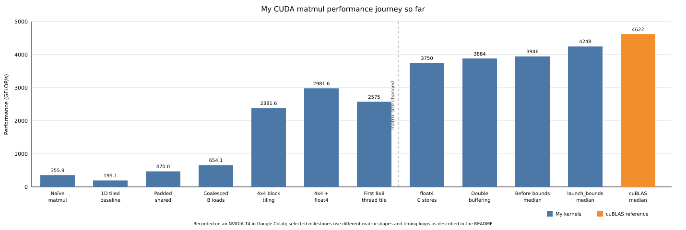

# CUDA kernels journey

This README documents my path from my first vector addition to a handwritten double-buffered matrix multiplication kernel reaching **3946 GFLOP/s median** and **4257 GFLOP/s on its best launch** on an NVIDIA T4, in the same benchmark cuBLAS reached a 4630 GFLOP/s median.

My code is not perfect and I am deliberately keeping my mistakes and intermediate kernels because I want to show the wrong assumptions, indexing problems and the changes behind the speedups, some results also use different matrix sizes or an older timing loop so I try to mention that instead of presenting every number as a controlled comparison.

## Complete performance journey so far

| Kernel iteration | What changed | Recorded GFLOP/s |
|---|---|---:|
| Naïve matmul | One thread calculates one result | 355.9 |
| 1D 32x32 tiled | First correct shared-memory tiles | 195.1 |
| Padded 1D tiles | Removed shared-memory bank conflicts | 470.0 |
| Coalesced B loads | Changed how B arrives from global memory | 654.1 |
| 2D 16x16 tiled | Moved to 2D blocks and shared memory | 639.9 |
| 1D blocktiling | Four results per thread | around 400 |
| 2D blocktiling 4x4 | Average over 20 launches | 2381.6 |
| 4x4 with `float4` loads | Vectorized global loads, median | 2981.6 |
| First 8x8 thread tile | More work per thread but initially slower | 2575 |
| `float4` C stores | Vectorized output stores, median | 3750 |
| Double buffering | Two alternating shared-memory tiles | 3884 |
| Remapped shared B reads | Bank-conflict fix, older timing loop | 4262* |
| Final separated benchmark | My kernel, median | **3946** |
| cuBLAS reference | Same final benchmark, median | **4630** |

`4262` came from the previous comparison loop and I still need to run that exact optimized variant with the final separated benchmark, so I do not use it as the headline result yet.



## Progress

I started with [`vector_add.cu`](vector-add/vector_add.cu) to understand allocation, copies and how threads map to values, then I wrote a [naïve matmul](matmul/naive-matmul.cu) where my first problems were actually outside the kernel because I allocated B with the wrong size, initialized the wrong pointer and copied A twice, after fixing it the kernel reached **355.9 GFLOP/s**.

My first [tiled version](tiled-matmul/tiled_matmul_1d.cu) used flattened shared memory because I had not learned 2D arrays yet and this made the indexing much harder for me, the first correct version only reached **195.1 GFLOP/s**, then I padded the B tile and later changed how B arrived from global memory so a warp could load consecutive values from a row:

```cpp
__shared__ float shared_memory_2[32*33];

shared_memory_2[columna_carga_2*33 + fila_carga_2] =
    mat2[j*K_col_2*32 + fila_carga_2*K_col_2 + block_col_num_2*32 + columna_carga_2];
```

The original stride of 32 made threads hit the same shared-memory banks, so changing it to 33 was enough to move the kernel from **195.1 to 470 GFLOP/s**, after that I noticed that B was still arriving through strided global loads and remapped the threads so each warp loads consecutive columns from a row, which reached **654.1 GFLOP/s**, it was the first time I could see two small changes related to the hardware make a large difference instead of shared memory just making the kernel faster automatically.

I later made a small [2D indexing exercise](2d-transposed/2d-transposed.cu), then a [2D naïve matmul](matmul/2d-naive-matmul.cu) and finally a [2D tiled version](tiled-matmul/tiled_matmul_2d.cu), using `threadIdx.x` and `threadIdx.y` with real 2D shared-memory tiles was much easier to follow than flattening everything and this version reached around **640 GFLOP/s**, but I also found that one version had `__syncthreads()` inside a bounds check which my dimensions were hiding and an edge block would hang.

My first [blocktiling attempt](blocktiling/blocktiling1d.cu) made each thread calculate four outputs in one direction, this was where I first tried to do more work per thread but the mapping is honestly overcomplicated and I had trouble following variables like `threadIdx_r4_1` and `threadIdxy4_1` while debugging it, when it finally worked it was also slower at around **400 GFLOP/s** which showed me that giving a thread more outputs was not automatically an optimization, after this file I started paying more attention to names, comments and removing dead code because I did not want the next kernel to become just as difficult for me to read.

## First 2D blocktiling kernel

In [`blocktiling2d.cu`](blocktiling/blocktiling2d.cu) every thread calculates a 4x4 section of C and keeps the results and the values being reused in these arrays:

```cpp
float sum[TM][TN] = {0.0f};
float regA[TM];
float regB[TN];
```

For every position in K a thread brings four values from A and four from B into those arrays and uses them to update 16 results, so the values read from shared memory do more work before the next ones are loaded, this reuse was the main difference from my previous version where a thread only owned results in one direction.

For the tile sizes I was comparing a smaller 32x32 block tile with the 64x64 one in the file, both could work but the smaller version only needed 64 threads while the 64x64 version uses 256 and also reuses the loaded tiles more, I kept K in chunks of 32 and made each thread own 4x4 results because it looked like a reasonable balance before knowing the real register count.

```text
0 bytes stack frame, 0 bytes spill stores, 0 bytes spill loads
Used 64 registers, used 1 barriers, 16384 bytes smem
```

The real result from `ptxas` was more registers than I expected but nothing spilled to local memory, this kernel reached a **2381.6 GFLOP/s average** and a best launch of 2774.8 GFLOP/s on `2048x1024 * 1024x2048`.

## From 4x4 blocktiling to the current kernels

The next thing I tried was using `float4` for the global loads in [`float4blocktiling2d.cu`](blocktiling/float4blocktiling2d.cu), instead of moving one float with each expression I adapted the indexes so the aligned loads bring four values:

```cpp
float4 f4_a = reinterpret_cast<const float4*>(A)[a_pointer / 4];
float4 f4_b = reinterpret_cast<const float4*>(B)[b_pointer / 4];
```

That moved the median from around **2382 to 2982 GFLOP/s**, I also tried using `float4` when moving B from shared memory into registers but both versions performed almost the same, so it looked like the compiler may already have been doing that part for me.

After the 4x4 version I adapted it into an [8x8 thread tile](blocktiling/8x8blocktiling2d.cu) with a 128x128 block tile, the idea was to perform more FFMA for the values loaded but the first result was actually slower at around **2575 GFLOP/s**, then I increased the multiplication to `4096x2048 * 2048x4096` because I suspected the earlier benchmark was not giving this kernel enough work, the time and GFLOP/s copied into that specific commit message do not agree with each other so the graph uses the next consistent large-matrix run at **3750 GFLOP/s** instead.

I also tried transposing A inside shared memory so that its register loads could use `float4`, the first 4x4 transposed version dropped from around 3007 to 2426 GFLOP/s and Nsight Compute showed many more conflicts when writing the transposed shared tile, padding helped some later 8x8 versions but this was another case where an optimization that looked reasonable in the code did not automatically help once measured.

On the padded 8x8 version some of the stall values I recorded with `ncu` were:

```text
barrier:         1.04
long scoreboard: 0.97
MIO throttle:    2.48
```

The kernel looked more balanced than my older 4x4 version, so the next experiment was [double buffering](double-buffering/double-buffering_2d_blocktiling.cu), I added two copies of each shared tile and alternate between them so the loads for the next K tile can be issued before finishing the compute for the current one:

```cpp
__shared__ float shared_memory_1[2][BM][BK];
__shared__ float shared_memory_2[2][BK][BN];

actual = 1 - actual;
```

This reached around **3884 GFLOP/s median**, only a moderate improvement which was not too surprising after seeing the low long-scoreboard value, I also initially skipped one K tile with the loop limit and the maximum difference immediately jumped to around 17 which helped me find that mistake.

The latest transposed double-buffering work came from noticing that the 8 values each thread read from shared B left gaps between neighbouring threads and created bank conflicts, I changed the ownership so threads first cover one contiguous half of the 128 columns and then the other:

```cpp
threadIdx.x*n_float + j*(BN-(blockDim.x*n_float))
```

That also meant the C output index had to follow the new ownership, the first version calculated correctly inside the kernel but wrote the results into the old positions and fixing that one expression was less straightforward than I expected, after the complete change this variant recorded **4262 GFLOP/s median** with the older timing loop.

## Current comparison with cuBLAS

I first measured my kernel and cuBLAS inside the same loop and the results moved more than I expected, in the latest comparison I put all launches of my kernel in one loop and all cuBLAS launches in another so they do not alternate and affect each measurement in the same way:

```text
My kernel  min 16.144 ms (4257 GFLOP/s)  mediana 17.416 ms (3946 GFLOP/s)
cuBLAS     min 14.131 ms (4863 GFLOP/s)  mediana 14.842 ms (4630 GFLOP/s)
```

Using the medians my kernel reaches about **85.2% of cuBLAS**, while comparing the two best launches gives about 87.5%, I prefer the median as the main number because it represents the complete set of launches better and the result has been consistent across the runs I made in Google Colab.

The final separated comparison currently uses the non-transposed double-buffering file while the 4262 GFLOP/s bank-conflict fix is in the transposed variant, so my next benchmark step is applying the final measurement loop to that exact variant before treating 4262 as the new repeatable result.

## Benchmark notes

All these numbers are kernel-only measurements recorded on an NVIDIA T4 in Google Colab, the latest runs reported 1590 MHz and a 70 W power limit, the early kernels and the first 4x4 blocktiling used smaller matrices while the newer 8x8 and double-buffering kernels use `4096x2048 * 2048x4096`, so the graph marks where that benchmark shape changed.

The kernels are still written for the aligned dimensions used in their tests and do not handle arbitrary leftover M, N or K tiles yet, the result checks compare the complete output against a CPU reference or cuBLAS but there is still benchmark variance and the commit history contains the exact results and failed versions behind this summary.

I used model help for parts of the benchmark code and for organizing parts of this README, the kernels and their indexing/debugging are my work.
